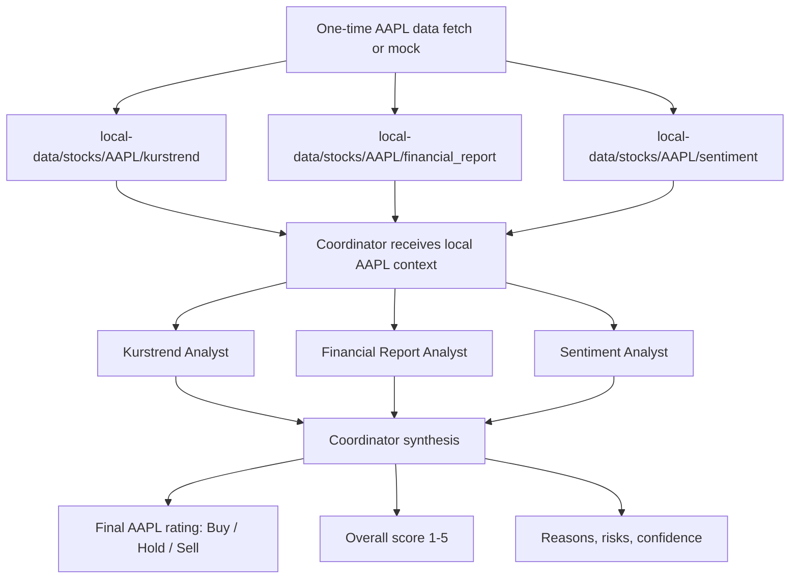

# AAPL Stock Ranking POC Flow

This POC ranks exactly one stock: `AAPL`.

The important constraint: data is fetched or mocked once before runtime and
saved locally. Runtime agents only read the local files.



## Subagent Data Contract

Local files use a deliberately small contract:

```text
local-data/stocks/AAPL/
├── kurstrend/data.json
├── financial_report/latest_quarterly_report.md
└── sentiment/data.json
```

Use the files like this:

| File | Purpose |
| --- | --- |
| `kurstrend/data.json` | `last_close`, `sma_20`, `sma_200`, `sma_1000`, `ema_20`, `ema_200`, `ema_1000` |
| `financial_report/latest_quarterly_report.md` | Latest quarterly report as Markdown |
| `sentiment/data.json` | Current `sentiment_value` |

## Agents

| Agent | Responsibility | Output |
| --- | --- | --- |
| `kurstrend` | SMA/EMA trend from saved JSON | Technical score 1-5 |
| `financial_report` | Latest quarterly report Markdown | Fundamental score 1-5 |
| `sentiment` | Current sentiment value from saved JSON | Sentiment score 1-5 |
| coordinator | Delegates, weights scores, synthesizes final result | Buy / Hold / Sell |

## Coordinator Weights

| Component | Weight |
| --- | ---: |
| Financial report | 40% |
| Kurstrend | 35% |
| Sentiment | 25% |

Rating mapping:

| Weighted score | Rating |
| --- | --- |
| `4.0 - 5.0` | Buy |
| `2.5 - 3.9` | Hold |
| `1.0 - 2.4` | Sell |
